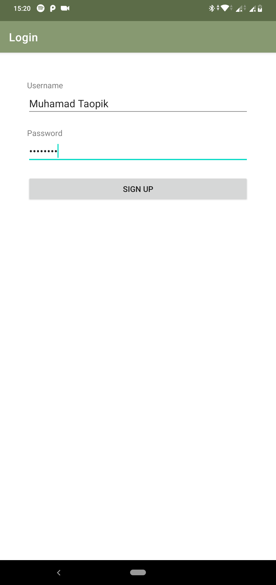
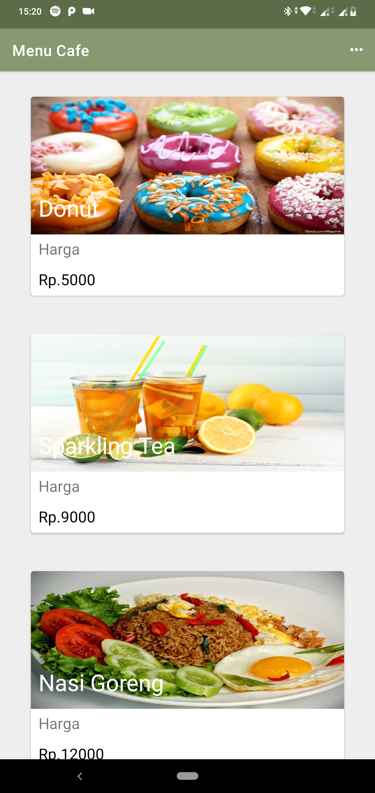
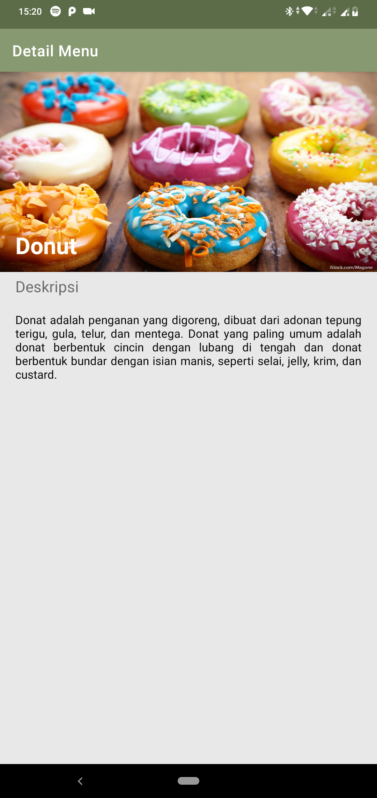
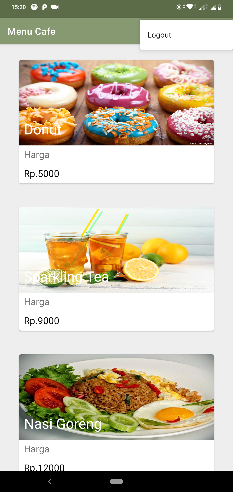

# CafeApp Description
[](https://android-arsenal.com/details/1/1234)

Untuk memenuhi syarat salah satu tugas `ujian tengah semester` mata kuliah **Praktikum Pengembangan Aplikasi Mobile**.

<h4>Username:</h4>

[](https://android-arsenal.com/details/1/1234)

```
Muhamad Taopik
```

<h4>Password:</h4>

[](https://android-arsenal.com/details/1/1234)

```
1q2w3e4r
```

# Results
[](https://android-arsenal.com/details/1/1234)

## 1. Login Layout



## 2. Menu Cafe



## 3. Detail Menu



## 4. Logout



# Last But Not Least

```
Build : run!
```
